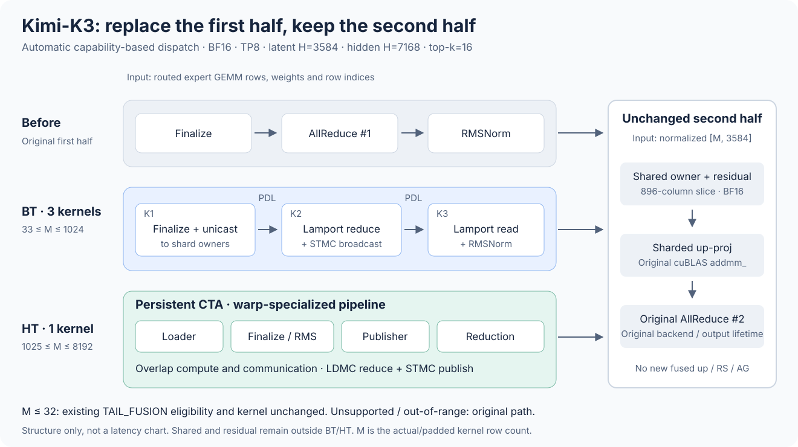

# Kimi-K3 BT/HT first-half optimization

BT/HT replaces routed-expert finalize, the first all-reduce (AR1), and latent
RMSNorm automatically when the model, device and backend capabilities match.
There is no environment switch or extra serving option. Unsupported
configurations retain the existing path.

This change does not introduce a fused up projection, ReduceScatter or
AllGather in the second half. Model forward, scheduler, graph configuration
and agentic benchmark files are unchanged.



## Protocol structure

The implementation follows [FlashInfer PR #4358](https://github.com/flashinfer-ai/flashinfer/pull/4358),
specialized for K3's routed latent tensor rather than the full hidden tensor.

- **BT: three PDL-chained kernels.** Finalize and unicast contributions to
  shard owners; Lamport-reduce owner-local contributions and multicast the
  prenorm values with STMC; Lamport-read/materialize and run RMSNorm.
- **HT: one persistent kernel.** Loader, finalize/RMS, publisher and reduction
  warp roles pipeline work. LDMC reduces contributions across ranks, and STMC
  publishes the prenorm values consumed by RMSNorm.

These counts cover only the first half, excluding the expert GEMM and the
unchanged second half. Unlike the upstream general fusion pattern, neither
shared-expert addition nor residual addition is enabled in these kernels:
both belong to K3's second half. Upstream default M thresholds are not reused.

## Dispatch and second-half contract

| Actual/padded kernel M | First half | Second half |
| --- | --- | --- |
| 1–32 | Original TAIL_FUSION eligibility/kernel or original fallback | Original |
| 33–1024 | BT deferred finalize + AR1 + RMSNorm | Original sharded cuBLAS projection, owner shared/residual arithmetic and AR2 |
| 1025–8192 | HT deferred finalize + AR1 + RMSNorm | Same original second half |
| Zero, above capacity, or unsupported configuration | Original dispatch | Original |

M is the token count seen by the kernel, not concurrency or total conversation
length. The policy covers continuous ranges, not a graph-bucket whitelist.
The original selector runs first. Its small-tail choice has priority, and its
ordinary/multimem decision is retained for AR2. In particular, decode and
speculative verification do not acquire a prefill-only multimem AR2 just
because their M crosses 256.

Both deferred tiers consume the producer's existing triple: BF16 expert rows,
BF16 top-k weights and int32 row indices. The producer's scaling remains in
the weights. BT/HT returns normalized `[M,3584]` routed output; shared and
residual tensors never enter these first-half kernels.

For the original multimem second half, shared staging remains before the
first-half collective. After BT/HT completes, each rank adds the residual to
its 896-column shared owner slice in BF16, calls the original cuBLAS `addmm_`,
runs the original staged AR2, then clones the result. For the ordinary second
half, the existing `_project_and_inject_local_block` and `all_reduce` are used.
Projection remains sharded. The second-half arithmetic/rounding order and
output lifetime are not changed.

## Kernel and capability boundaries

Runtime reaches optional backends only through `tokenspeed_kernel.ops`.
The existing FlashInfer BT device implementation is not modified. HT retains
the selected native-3584 specialization: each TP8 latent shard contains 56
BF16x8 vectors, so the final reduction warp is predicated.

The retained presets are:

- BT: 256 finalize threads, 2 elements/thread, prefetch group 1, 224 reduction
  threads, 448 RMS threads, PDL enabled.
- HT: 448 consumer threads, 1 vector/thread, 10 stages, 2 reduction warps,
  2 RMS token groups, 3 RMS pipeline stages, PDL enabled.

The fixed application contract
is BF16, latent 3584, hidden 7168, top-k 16, TP8/EP1, DP1/CP1, sharded up
projection and a deferred-capable producer. It also requires a WORLD-spanning
multicast-capable Blackwell group, the validated FlashInfer 0.6.18 API and PDL.
Optional imports remain lazy behind the kernel boundary.

Rank agreement and the retained joint BT/HT capability vote precede backend
construction. Unsupported configurations fall back uniformly; exceptions
after collective construction starts propagate rather than strand peers via
rank-local fallback.

## Workspace and graph lifetime

BT/HT protocol storage and normalized latent outputs are process-wide, shared
by sequential layers. Construction/compilation happen before graph capture;
attempting cold collective construction during capture is rejected. Kernel
replay does not allocate or enter host collectives. Keep the protocol buffers
alive for every graph replay; concurrent workspace use is not supported.

This branch has no large-M second-half fused workspace, multicast-output ring,
or independent `[8192,7168]` symmetric output allocation per layer. The normal
small-M latent-tail resources and original multimem staging buffers remain.
BT/HT still has its own memory cost: removing the second-half allocations does
not establish memory neutrality or predict an exact KV-capacity recovery.

## Validation

CPU-only checks, which do not require optional GPU packages:

```bash
PYTHONPATH=python python -m pytest --noconftest \
  test/runtime/test_k3_moe_tail_tier.py \
  test/runtime/test_k3_first_half.py \
  tokenspeed-kernel/test/thirdparty/test_mnnvl_first_half_host_contracts.py -q
```

The tests cover automatic capability-based selection, continuous routing,
small-M priority, decode's original AR2, rank disagreement, capture rejection,
retained tuning/resource validation, no second-half allocation, and both
BT/HT second-half operation orders.

On a separately allocated and configured TP8 fabric:

```bash
timeout 20m torchrun --standalone --nproc-per-node=8 \
  test/runtime/smoke_k3_first_half.py --output-dir /tmp/k3-first-half-smoke
```

Use the normal rendezvous/node arguments for multi-node TP8. This synthetic
real-communication smoke exercises eager/128 graph replays, changed inputs
and weights, boundary M values and two layer slots under unchanged numerical
limits. It is not a real SiTU-producer or serving benchmark. The smoke is
provided for device validation; it has not been rerun for this default-path
change. No new performance benchmark is included or claimed in this change.
Upstream performance figures describe different shapes and are not evidence
of K3 end-to-end speedup.

First-half reduction association and BF16 rounding can differ from the
original path. CPU tests do not establish distributed numerical correctness
or whole-model equivalence; full-model numerical qualification remains open.
